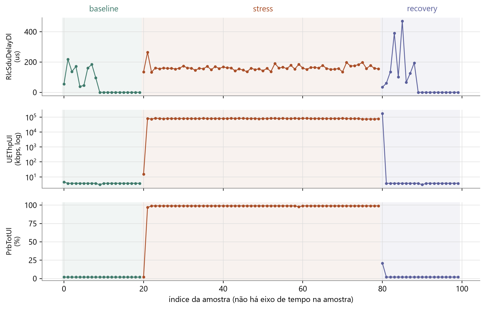
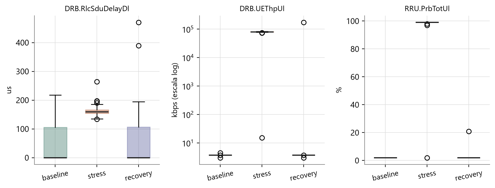

# Checkpoint 1 — Ingestão, QC e EDA

**Grupo 1 · Tema G2 — Anomalia de carga**

Disciplina 9 · Análise de Dados em Redes de Telecom · CESAR School

> **Nota de entrega.** Este documento consolida o Checkpoint 1 (previsto para a Aula 03,
> 25/08/2026) e é entregue em 29/08/2026, junto com o pacote final. O conteúdo abaixo
> corresponde ao que está no repositório e é reproduzível pelo notebook
> [`code/notebooks/01_etl_qc.ipynb`](../code/notebooks/01_etl_qc.ipynb).

## Evidência exigida × onde está

| Item do checklist | Onde |
|---|---|
| Abrir `kpm.sqlite` / JSONL do pacote | Seção 1 · notebook 01, células 1–2 |
| Documentar fases (baseline / stress / recovery) | Seção 2 |
| Registrar qualidade (nulos, duplicatas, timezone / `ingested_at`) | Seção 3 · `derived/etl_qc.json` |
| Duas consultas (SQL ou pandas) | Seção 4 |
| Dois plots com unidades e contraste entre fases | Seção 5 |
| Dois indicadores preliminares do card G2 | Seção 6 |
| README parcial (origem, timezone, gaps, como rodar) | [`README.md`](../README.md), seções 1 e 2 |

---

## 1. Dados carregados

Fonte obrigatória (trilha offline): `code/datasets/kpm-ue-tp-sample/kpm.sqlite`.
Execução `ue-tp-20260804-174422`, caso `ue-tp-load-anomaly`, gerada no laboratório
`oai-cn-gnb-nonrt-nearrt` — gNB OAI em RFSIM com agente E2, Near-RT RIC (FlexRIC) e xApp
assinando E2SM-KPM.

O banco tem duas tabelas:

| Tabela | Conteúdo |
|---|---|
| `runs` | 1 linha: `run_id`, `created_at`, `use_case`, `notes` |
| `kpm_samples` | 100 linhas: `phase`, `sample_index`, `ingested_at`, `source_path`, `payload_json` |

As métricas ficam serializadas em `payload_json`, uma chave por métrica:

| Métrica | Unidade | Significado |
|---|---|---|
| `RRU.PrbTotUl` | % | Ocupação de PRB no uplink |
| `DRB.UEThpUl` | kbps | Vazão do UE no uplink |
| `DRB.RlcSduDelayDl` | µs | Atraso de SDU RLC no downlink |

O `kpm.jsonl` traz os mesmos pontos e é mantido como espelho da camada bronze; não é
reprocessado. **A fonte não é alterada** — todo tratamento acontece a jusante, em código.

## 2. Fases documentadas

As três fases do roteiro do experimento estão presentes:

| Fase | Amostras | Papel no experimento |
|---|---|---|
| `baseline` | 20 | Rede ociosa, tráfego residual — é o comportamento de referência |
| `stress` | 60 | Carga de uplink gerada por `iperf` |
| `recovery` | 20 | Retorno ao repouso após o teste |

A carga é gerada por `iperf` saturando o uplink. Isso significa que, na fase de stress,
a vazão **sobe** em vez de degradar: a anomalia deste laboratório é de **carga**, não de
falha. É a leitura correta do card do G2 e determina o desenho do detector.

## 3. Qualidade dos dados

Resultados calculados em código e exportados para
[`derived/etl_qc.json`](../derived/etl_qc.json).

### Nulos

Nenhuma das três métricas tem valor nulo: `fracao_nula = 0,0` para as três.

Porém, o README da amostra documenta uma quarta métrica, `DRB.UEThpDl`, que **não existe**
no arquivo. Confirmado lendo as chaves de todos os 100 payloads: só há três chaves.

### Atraso igual a zero — ausência disfarçada de medida

| Fase | Amostras com `DRB.RlcSduDelayDl = 0` | Total |
|---|---|---|
| `baseline` | 11 | 20 |
| `stress` | 0 | 60 |
| `recovery` | 11 | 20 |

Zero de atraso de RLC não é fisicamente plausível. A leitura é que a métrica **não foi
reportada na Indication** e o parser do laboratório gravou 0. O gráfico da seção 5 torna
isso visível: nas fases calmas, o atraso cai para uma linha reta em zero na segunda
metade de cada bloco.

Este é o achado com maior consequência: tratado como medida válida, o zero puxa a mediana
de referência para 0 e faz qualquer atraso não-nulo parecer anômalo.

### Duplicatas

A tupla `(DRB.RlcSduDelayDl = 0 ; DRB.UEThpUl = 3,72 ; RRU.PrbTotUl = 2,0)` aparece
**10 vezes** no baseline e **10 vezes** no recovery — 18 linhas duplicadas no total.
É repetição do mesmo valor de contador, não amostragem independente. O baseline é menos
informativo do que `n = 20` sugere.

### Timezone e ausência de eixo de tempo

Todos os `ingested_at` estão em **UTC** (sufixo `+00:00`). Mas as 100 amostras
compartilham apenas **três** valores distintos — um por arquivo de fase:

| `ingested_at` | Fase | Amostras |
|---|---|---|
| `2026-08-04T20:44:22.310716+00:00` | baseline | 20 |
| `2026-08-04T20:44:22.532550+00:00` | stress | 60 |
| `2026-08-04T20:44:22.670212+00:00` | recovery | 20 |

**Não há eixo de tempo por amostra.** O que existe é o `sample_index` dentro de cada fase.
Consequência declarada: nenhuma métrica em unidade de tempo — duração de anomalia em
segundos, taxa por minuto — é defensável neste conjunto. Duração se expressa em número de
amostras consecutivas.

### Gaps e desbalanceamento

Não há lacunas de índice: os `sample_index` são contíguos dentro de cada fase. O
desbalanceamento é o ponto de atenção — **60 % das amostras estão em stress**, então todo
indicador precisa ser reportado por fase; uma taxa global ficaria inflada.

Não há coluna `ue_id` no payload: o experimento tem **um único UE**. Qualquer agregação
"de célula" seria didática, não estatística.

## 4. Duas consultas

### Consulta 1 — SQL: contagem, execuções e timestamps por fase

```sql
SELECT phase, COUNT(*) AS n,
       COUNT(DISTINCT ingested_at) AS timestamps,
       COUNT(DISTINCT run_id) AS runs
FROM kpm_samples
GROUP BY phase
ORDER BY phase;
```

| phase | n | timestamps | runs |
|---|---|---|---|
| baseline | 20 | 1 | 1 |
| recovery | 20 | 1 | 1 |
| stress | 60 | 1 | 1 |

Confere com o `db_summary.json` distribuído com a amostra. A coluna `timestamps` é a
evidência quantitativa da ausência de eixo de tempo.

### Consulta 2 — pandas: perfil das três métricas por fase

```python
amostras.groupby("phase", observed=True)[FEATURES].agg(["median", "min", "max"]).round(2)
```

| Fase | Delay RLC (µs) mediana / min / máx | Vazão UL (kbps) mediana / min / máx | PRB UL (%) mediana / min / máx |
|---|---|---|---|
| `baseline` | 0,00 / 0,00 / 218,00 | 3,72 / 3,00 / 4,46 | 2,00 / 2,00 / 2,00 |
| `stress` | 158,90 / 133,74 / 264,75 | 80 023,68 / 15,16 / 82 823,86 | 99,00 / 2,00 / 99,00 |
| `recovery` | 0,00 / 0,00 / 470,00 | 3,72 / 3,00 / 172 316,90 | 2,00 / 2,00 / 21,00 |

Três leituras imediatas: o PRB vai de 2 % a 99 % e satura; a vazão varia quatro ordens de
grandeza; e os extremos de `recovery` (470 µs de atraso, 172 Mbps de vazão) mostram que a
volta ao repouso não é instantânea — há cauda do `iperf` drenando.

## 5. Dois plots

### Plot 1 — Séries brutas das três métricas, por fase



Eixos com unidade; vazão em escala logarítmica por causa da amplitude. As faixas
sombreadas separam as fases.

**Insight.** As três métricas mudam de patamar em bloco na entrada do stress (amostra 20)
e retornam na saída (amostra 80). O atraso, porém, comporta-se de forma diferente das
outras duas: nas fases calmas ele alterna entre valores plausíveis e uma sequência de
zeros — a assinatura visual do achado da seção 3.

### Plot 2 — Distribuição por fase



**Insight.** PRB e vazão separam as fases sem sobreposição. O atraso, não: as caixas de
`baseline` e `recovery` são largas e ancoradas em zero justamente por causa das amostras
não reportadas, e chegam a se sobrepor à de `stress`. Já nesta leitura preliminar o atraso
aparece como o discriminante mais fraco dos três.

## 6. Dois indicadores preliminares

O card do G2 pede percentual de amostras anômalas por fase e intensidade do desvio. Ambos
derivam de um escore robusto por mediana e MAD, treinado no baseline:

```
escala_f  =  max( MAD_f × 1,4826 ;  1,0 )
escore_f  =  | x_f − mediana_baseline_f |  /  escala_f
```

Métrica anômala quando `escore_f ≥ 3,5`; amostra anômala quando ao menos duas das três
métricas são anômalas. Os parâmetros vêm do `model.json` do laboratório.

| Indicador | Definição preliminar | Unidade |
|---|---|---|
| **TAA** — taxa de amostras anômalas | `100 × amostras anômalas / amostras da fase` | % de amostras |
| **ISC** — índice de severidade de carga | média dos escores normalizados pelo limiar | adimensional |

Resultados preliminares:

| Fase | n | TAA | ISC mediano |
|---|---|---|---|
| `baseline` | 20 | 0,0 % | 0,03 |
| `stress` | 60 | 100,0 % | 10,00 |
| `recovery` | 20 | 5,0 % | 0,03 |

**A refinar no CP2.** Duas questões ficaram abertas nesta etapa e são tratadas no
Checkpoint 2: (a) o ISC precisa de saturação, porque o escore da vazão em kbps domina a
média; (b) o tratamento do atraso zero como ausência muda o baseline e precisa ser
avaliado contra a variante sem correção.

## 7. Como reproduzir

```bash
python -m venv .venv && source .venv/bin/activate
pip install -r requirements.txt
cd code/notebooks && jupyter lab
# executar 01_etl_qc.ipynb
```

Testado com Python 3.12, `pandas 3.0.5` e `matplotlib 3.11.1`. Não é necessário subir o
laboratório E2 — a fonte é o SQLite versionado no repositório.

Sem instalar nada: [`simulador-notebooks.html`](../simulador-notebooks.html) reproduz o
notebook célula a célula no navegador, com as saídas reais.
