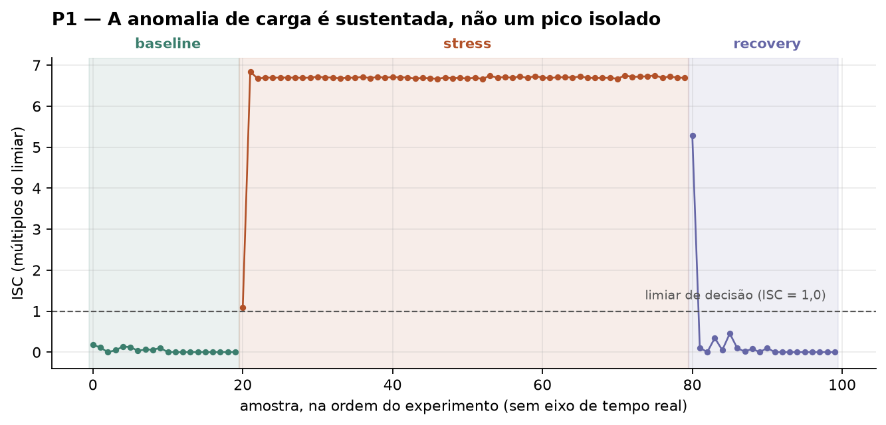
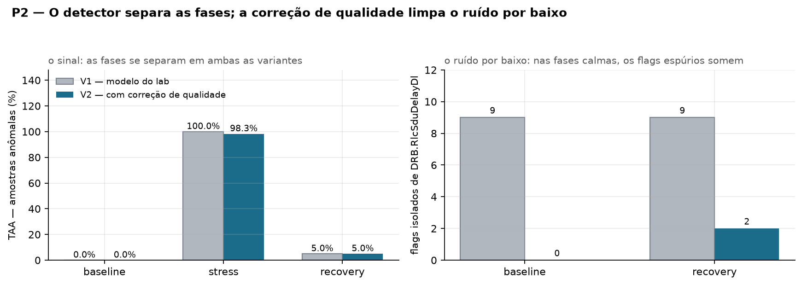

# Checkpoint 2 — Indicadores formais e visualizações

**Grupo 1 · Tema G2 — Anomalia de carga**

Disciplina 9 · Análise de Dados em Redes de Telecom · CESAR School

> **Nota de entrega.** Este documento consolida o Checkpoint 2 (previsto para a Aula 04,
> 27/08/2026) e é entregue em 29/08/2026, junto com o pacote final. O conteúdo é
> reproduzível pelo notebook [`code/notebooks/02_kpis_g2.ipynb`](../code/notebooks/02_kpis_g2.ipynb).

## Evidência exigida × onde está

| Item do checklist | Onde |
|---|---|
| Dois indicadores com fórmula explícita no README | Seção 2 · [`README.md`](../README.md), seção 4 |
| Visualizações finais ligadas à pergunta do tema | Seção 4 |
| Interpretação: o que o indicador diz operacionalmente | Seção 3 |
| Texto curto: o que o indicador **não** prova | Seção 6 |

**Pergunta do tema.** Em que momentos a rede sai do comportamento normal de forma
**sustentada** — e não em picos isolados?

---

## 1. O escore base

Os dois indicadores derivam de um mesmo escore robusto, treinado na fase de referência:

```
escala_f  =  max( MAD_f × 1,4826 ;  1,0 )
escore_f  =  | x_f − mediana_baseline_f |  /  escala_f

métrica anômala  ⇔  escore_f ≥ 3,5
amostra anômala  ⇔  ao menos 2 das 3 métricas anômalas
```

A constante 1,4826 converte o MAD em estimativa robusta de desvio-padrão sob normalidade.
Mediana e MAD foram escolhidos por resistirem a outliers — e o outlier é justamente o
objeto da análise; média e desvio-padrão seriam contaminados pela própria anomalia.

O limiar 3,5, o mínimo de duas métricas e o piso de escala 1,0 vêm do `model.json` do
laboratório e foram mantidos para permitir conferência.

**Duas variantes.** **V1** usa o baseline como está — é o modelo do laboratório.
**V2** trata `DRB.RlcSduDelayDl = 0` como ausência de medida, conforme o achado do
Checkpoint 1.

| | mediana do atraso no baseline | escala |
|---|---|---|
| V1 | 0 µs | 1,00 |
| V2 | 137 µs | 69,68 |

### Verificação contra os artefatos do docente

O modelo V1 reproduz mediana e MAD do `model.json` nas três métricas, e os escores da
amostra registrada em `decision.json`:

| Métrica | Valor | Escore do docente | Escore do grupo |
|---|---|---|---|
| `DRB.RlcSduDelayDl` | 154,88 µs | 154,88 | 154,88 |
| `DRB.UEThpUl` | 77 216,56 kbps | 77 212,84 | 77 212,84 |
| `RRU.PrbTotUl` | 99,00 % | 97,00 | 97,00 |

O notebook interrompe a execução por `assert` se a conferência falhar. Isso garante que a
divergência entre V1 e V2 é **deliberada**, e não um defeito de implementação.

## 2. Os dois indicadores — fórmulas fechadas

### KPI 1 — TAA · Taxa de Amostras Anômalas

```
TAA(fase)  =  100 × n_amostras_anômalas(fase) / n_amostras(fase)
```

| | |
|---|---|
| **Unidade** | % de amostras |
| **Granularidade** | por fase, dentro de uma execução (`run_id`) |
| **Fonte** | `kpm_samples.payload_json` + `kpm_samples.phase` |

### KPI 2 — ISC · Índice de Severidade de Carga

```
ISC(amostra)  =  média_f [ min( escore_f / 3,5 ;  10 ) ]
```

| | |
|---|---|
| **Unidade** | adimensional, em múltiplos do limiar (1,0 = exatamente no limiar) |
| **Granularidade** | por amostra; agregado por fase em mediana, média e máximo |
| **Fonte** | escores das métricas presentes na amostra |

O índice `f` percorre as métricas; `média_f` é a média sobre elas. O denominador é o
número de métricas **efetivamente reportadas** naquela amostra: em V2, quando o atraso é
descartado por valer zero, a média é sobre duas métricas em vez de três. Ausência não é
imputada.

**Por que saturar em 10.** Sem o teto, o escore de `DRB.UEThpUl` chega a **77 213**, porque
a escala do baseline degenerou para 1,0 kbps (MAD nulo, piso assume). A média sem
saturação deixaria de ser adimensional e passaria a medir vazão em kbps sob outro nome.

## 3. Interpretação operacional

**O que a TAA diz.** Quanto de uma janela o detector considera fora do comportamento de
referência. Lida por fase, mede duas coisas ao mesmo tempo: sensibilidade na fase de carga
e taxa de falso alarme nas fases calmas. É o indicador que responde diretamente à pergunta
do tema.

**O que o ISC diz.** Quão longe do normal, e não apenas se está fora. Permite distinguir
uma amostra que apenas cruzou o limiar (ISC ≈ 1) de um regime de saturação (ISC ≈ 6,6).
Em operação, é o que separaria um alerta informativo de um alerta acionável.

**Como se complementam.** A TAA sozinha não distingue um desvio marginal de uma saturação;
o ISC sozinho não diz por quanto tempo a condição se manteve. Juntos sustentam a regra de
decisão: janela de 5 amostras com voto majoritário, que só dispara quando o desvio é
sustentado.

## 4. Resultados e visualizações

| Fase | n | TAA · V1 | TAA · V2 | ISC médio · V1 | ISC médio · V2 |
|---|---|---|---|---|---|
| `baseline` | 20 | 0,0 % | 0,0 % | 1,51 | 0,04 |
| `stress` | 60 | 100,0 % | 98,3 % | 9,91 | 6,61 |
| `recovery` | 20 | 5,0 % | 5,0 % | 1,76 | 0,33 |

### Visualização 1 — Severidade ao longo do experimento



**Ligação com a pergunta do tema.** 59 das 60 amostras de stress permanecem acima do
limiar, em sequência contínua. O desvio é um **regime**, não um transiente — que é
exatamente o que a pergunta do G2 pede para distinguir.

### Visualização 2 — Efeito da correção de qualidade



**Ligação com a pergunta do tema.** O painel da esquerda mostra que a separação entre
fases não depende da correção — o sinal é robusto. O da direita mostra onde a correção
age: nos flags isolados de atraso nas fases calmas, que caem de nove para zero em
`baseline` e para dois em `recovery`.

### Visualizações de apoio

[`figures/p3_distribuicoes.png`](../figures/p3_distribuicoes.png) — distribuição das três
métricas por fase; só a vazão precisa de escala logarítmica, o que motiva a saturação do ISC.

[`figures/p4_matriz_features.png`](../figures/p4_matriz_features.png) — quais métricas
disparam, amostra a amostra: no stress, PRB e vazão disparam em conjunto; o atraso sozinho
nunca basta.

## 5. Leituras que os indicadores sustentam

1. **A separação entre fases é inequívoca:** 0 % contra 98,3 % de amostras anômalas, e
   severidade média de 0,04 contra 6,61 — mais de duas ordens de grandeza.

2. **A regra de concordância entre duas métricas é o que torna o detector utilizável.**
   No baseline V1, nove amostras disparam a flag de atraso isoladamente e nenhuma vira
   decisão. Relaxando a regra para uma única métrica, a TAA de baseline saltaria de 0 %
   para **45 %**.

3. **A correção de qualidade elimina a causa raiz do ruído**, sem alterar o sinal: o ISC
   médio de baseline cai de 1,51 para 0,04.

4. **PRB e vazão são as métricas discriminantes.** Em V2 o atraso deixa de disparar
   também durante o stress — com mediana 137 µs e escala 69,68, os ~159 µs da fase de
   carga ficam a menos de meio desvio. Isso não altera a decisão, porque vazão e PRB já
   satisfazem a regra, mas mostra que **o atraso RLC não é bom discriminador de carga
   neste laboratório**.

## 6. O que os indicadores **não** provam

- **A TAA não mede tempo.** Não há timestamp por amostra (achado do CP1). Ela mede fração
  de amostras, e as amostras não são equiespaçadas por construção. Duração de anomalia se
  expressa em amostras consecutivas, nunca em segundos.

- **O ISC não é probabilidade** nem grau de confiança. É distância ao baseline em
  múltiplos do limiar, saturada. É comparável entre fases da mesma execução, não entre
  execuções diferentes — a escala depende do baseline treinado.

- **Nenhum dos dois prova causa.** Dizem que a rede saiu do comportamento de referência,
  não por quê. Uma degradação de UPF ou de fronthaul apareceria aqui como "anomalia de
  rádio", sem que o conjunto permita distinguir.

- **As fases são rótulo de construção do experimento**, não verdade de campo
  independente. Verificou-se concordância com o roteiro do laboratório; não houve
  validação contra medida externa.

- **A amostra não sustenta generalização.** 100 amostras, uma execução, um único UE,
  telemetria RFSIM. O conjunto demonstra o método; não caracteriza o comportamento de uma
  rede real.
